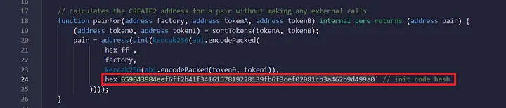

# Getting Started for foundry

## Requirements

Please install the following:

- [Git](https://git-scm.com/book/en/v2/Getting-Started-Installing-Git)
  - You'll know you've done it right if you can run `git --version`
- [Foundry / Foundryup](https://github.com/gakonst/foundry)
  - This will install `forge`, `cast`, and `anvil`. [Installation Instructions](https://book.getfoundry.sh/getting-started/installation)
  - You can test you've installed them right by running `forge --version`

## Quickstart

```sh
git clone https://github.com/fullstack-development/Uniswap-v2-Fork-SC.git
cd UNISWAP-V2-FORK-SC
forge install
forge build
```
# Deploying to a network

## Setup

You need to create a file `.env` in the project and add the following variables to it:

- `POLYGON_TESTNET_RPC_URL`: A URL to connect to the zkEvm Polygon testnet. You can get one for free from [here](https://www.alchemy.com/chain-connect/chain/polygon-zkevm).
- `POLYGON_MAINNET_RPC_URL`: A URL to connect to the zkEVM Polygon mainnet.
- `PRIVATE_KEY`: A private key from your deploying wallet. You can get a private key from a new [Metamask](https://metamask.io/) account.
- `POLYSCAN_API_KEY`: To verify a contract on [zkevm polygonscan](https://zkevm.polygonscan.com/).

## Deploying

We have two ```--rpc-url``` options:

- testnet is ```zkEVMPolygonTestnet```
- mainnet is ```zkEVMPolygonMainnet```

You can choice option depends on the network you want to deploy to.

1) Deploy uniswapV2 Factory

To deploy uniswapV2 Factory, you will need to pass ```_FEETOSETTER``` address right after ```--constructor-args``` in the code below. The wallet allowed to set the fees’ wallet

```bash
source .env
forge create src/v2-core/UniswapV2Factory.sol:UniswapV2Factory --rpc-url zkEVMPolygonTestnet --private-key ${PRIVATE_KEY} --constructor-args "putFeeToSetterAddressHere" --legacy
```
if you are windows user, you might have error - "Failed to create wallet from private key. Private key is invalid hex: Odd number of digits"

To resolve this problem, you need to remove the ```\r``` symbol from private key. To do it, you can run ```PRIVATE_KEY=$(echo $PRIVATE_KEY | tr -d '\r')```

Save the address of Fabric contract.

Now, to get initial code hash of the Pair contract, we need to install ethers library and run computation script.

```bash
npm install --save ethers and node ./script/compute.js
```

```bash
node ./script/compute.js
```
Save this initial code hash 

1) Deploy uniswapV2 Router

We need to put our initial code hash of the Pair contract to the library called UniswapV2Library.sol

We insert (line 24) the ```INIT_CODE_HASH``` we saved earlier without the leading “0x”.



To deploy UniswapV2Router02, you will need to pass ```_FACTORY```  and ```_WETH``` addresses right after ```--constructor-args``` in the code below.

We put Factory address that we saved earlier as the first constructor argument.
As the second argument for zkEVM polygon mainnet we can use [WETH](https://zkevm.polygonscan.com/token/0x4f9a0e7fd2bf6067db6994cf12e4495df938e6e9) address.

If we want to deploy to testnet, we can use this command to deploy our WETH contract.

```bash
forge create src/erc-20-tokens/WETH.sol:WETH9 --rpc-url zkEVMPolygonTestnet --private-key 'privateKey' --legacy
```

Now we are ready to run deploy with this command:

```bash
forge create src/v2-periphery/UniswapV2Router02.sol:UniswapV2Router02 --rpc-url zkEVMPolygonTestnet --private-key ${PRIVATE_KEY} --constructor-args "factoryAddressPutHere" "WETHAddressPutHere" --legacy
```
To be able to make batch requests to smart contracts as frontend, you will need to deploy [Multicall](src\Multicall.sol) contract:

```bash
forge create src/Multicall.sol:Multicall --rpc-url zkEVMPolygonTestnet --private-key ${PRIVATE_KEY} --legacy
```
_if you want to deploy erc-20 tokens to test your protocol, you can use this code below. It will deploy all erc-20 tokens in erc-20-tokens folder and mint those tokens to your account._

```bash
chmod +x ./script/deploy.sh
```

```bash
source .env
./script/deploy.sh putYourWalletAddressHere
```

deployed addresses [here](./DeployAddresses.txt)